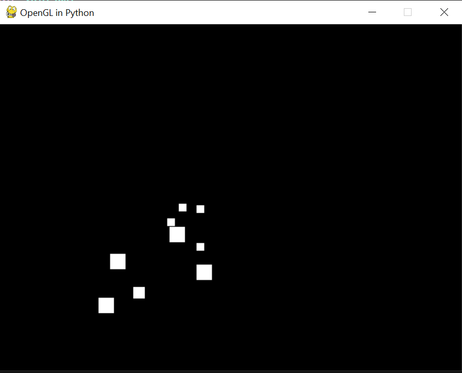
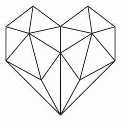
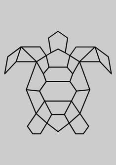

> **ACTIVITY**
>
> **COMPUTER GRAPHICS**

1.  How many pixels are placed on the screen by each of these calls?

> `g.drawLine(10, 20, 100, 50);`
>
> `g.drawRect(10, 10, 8, 5);`
>
> `g.fillRect(10, 10, 8, 5);`

2.  Develop an interactive graphics application where the user can draw
points on the screen by clicking with the mouse. This activity must be
done using the integration between Pygame and OpenGL, as well as the
basic concepts of event handling and graphic rendering.

Requirements: Python 3, Pygame, PyOpenGL.

Instructions: Read and understand the skeleton code presented during
classes.

Make sure that when you click in the window, one or more points are drawn
at the click position.

3.  Based on the previous activity, add features to the code created in
activities 1 and 2:

    A. Change the color of the points.

    B. Adjust the size of the points.

    C. Add a reset button to clear all points.

4.  Building on the previous activities you must:

    A. Draw lines connecting the points in the order they were clicked.

    B. Implement different geometric shapes (such as triangles or
    squares) that can be drawn by clicking with the mouse.

Research activity:

5.  In this activity, you will create a graphics application that draws a
basic geometric shape such as rectangles, triangles, and lines. The
geometric shape has to make sense, like the examples below:

Use your creativity!

{width="0.7952777777777778in"
height="1.0609175415573053in"} {width="1.2771347331583551in"
height="1.2771347331583551in"}{width="0.9875in"
height="1.3993055555555556in"}

**ALL CODE MUST BE COMMENTED**
