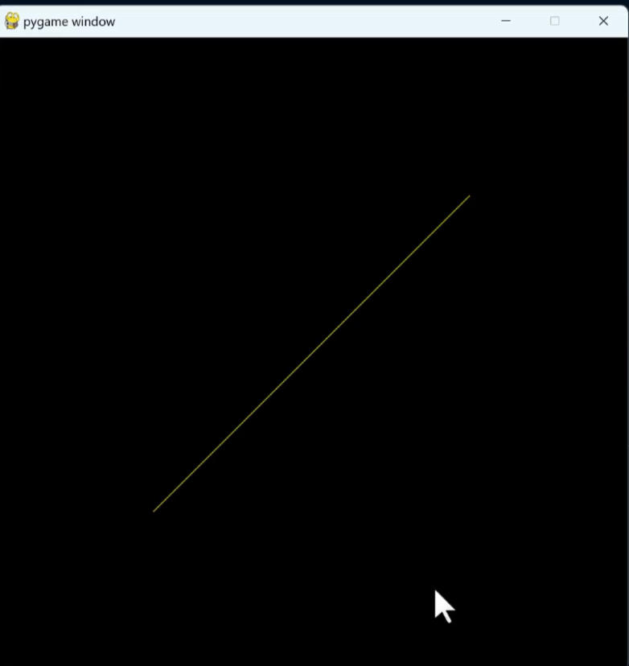
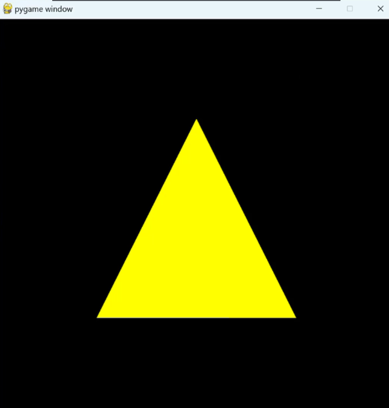

LEARNING ACTIVITY

1.  First challenge.

Draw a line identical to the one shown in the image below.

{width="3.0195133420822398in"
height="3.1970483377077867in"}

2.  Second challenge.

You must build a constellation of points on the Pygame screen. To finish
the task, first install PyOpenGL as demonstrated in class.

{width="2.8653062117235346in"
height="2.3164370078740157in"}

3.  Third challenge:

> {width="2.1616633858267718in"
> height="2.268678915135608in"}
